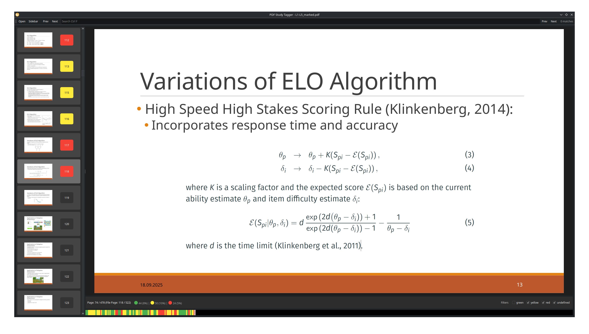

# PDF Study Tagger

A small tool I built to help with exam prep as I couldn’t find anything similar online. It lets you tag and filter pages by color in large PDF slide decks to focus your studying. Built with PyQt6 and PyMuPDF.

## Preview

## Features
- Page Tagging: mark pages as  
  - Green → Known  
  - Yellow → Review  
  - Red → Hard
- Auto-jump: automatically move to the next page after tagging.
- Filtering: show only certain tag types based on checkboxes.
- Thumbnail sidebar: view all pages with tag colors. Works with filters.
- Timeline overview: compact color bar for quick navigation an overview.
- Text search: search pages with Ctrl+F.
- Copy tools: copy both text or the page as image to clipboard.
- Export selection: export current selection as PDF.

## Getting started
This code was tested on Linux but should work on Windows and macOS.

### 1. Install Requirements
pip install PyQt6 PyMuPDF ([virtual environment](https://docs.python.org/3/library/venv.html) is recommended).

### 2. Run the Tool
Combine your slides into one PDF, then run `python pdf_tagger.py [optional_pdf_path]`.

Or just run without arguments and open a file through the app.

## Shortcuts
| Key | Action |
| --- | --- |
| ↓ / → | Next page |
| ↑ / ← | Previous page |
| 1 | Tag Green (Known) |
| 2 | Tag Yellow (Review) |
| 3 | Tag Red (Hard) |
| 4 | Clear tag |
| C | Copy all text on page |
| Shift+C | Copy page as image |
| Ctrl+C | Copy selected text |
| Ctrl+F | Focus search box |
| Ctrl+A | Select all text on page |
| Ctrl+S | Save current selection as PDF |
| Enter | Go to next match in search |

## Mouse controls
- Page View: Click and drag to select text.  
- Sidebar: Click to jump, Ctrl or Shift+Drag to select multiple pages.  
- Timeline: Click to jump to a page.  
- Filter Area: Toggle which tag colors are shown.  

## Tag saving
Tags are saved automatically to `[your_pdf_name]_pdf-tagger-sav.json` in the same folder as your PDF.

## Known limitations
- Text selection is a bit clunky.  
- Tags may stop matching if the PDF’s page order changes, for example when pages are added, removed, or rearranged.
